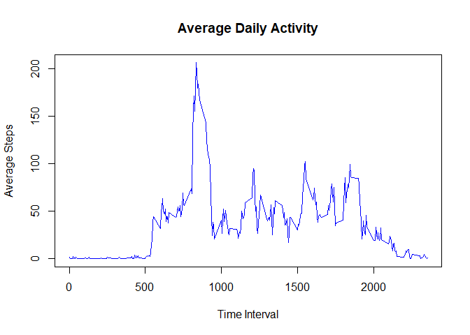

## Loading and preprocessing the data
Here, I unzip and read the CSV file into a dataframe. I then change the date variable to the Date format. I also add a column to the data frame to convert the intervals to time of day in hours and minutes.

```
## 'data.frame':	17568 obs. of  4 variables:
##  $ steps    : int  NA NA NA NA NA NA NA NA NA NA ...
##  $ date     : Date, format: "2012-10-01" "2012-10-01" ...
##  $ interval : int  0 5 10 15 20 25 30 35 40 45 ...
##  $ timeofday: chr  "00:00" "00:05" "00:10" "00:15" ...
```


## What is mean total number of steps taken per day?

<!-- -->

From the histogram, we can see that the total number of steps is slightly skewed, but the mean and median are very nearly the same because the mean total number of steps per day was 10766.19, and the median was 10765.

## What is the average daily activity pattern?

<!-- -->

The time of the day with the highest maximum steps was 08:35.

## Imputing missing values


There are a total of 2304 in the steps data. To account for this, I am going to impute the mean value for each interval for those values.

<!-- -->

The new mean after imputing the mean for the NA values is 10766.19 and the new median is 10766.19. These values and the histogram have not really changed.

## Are there differences in activity patterns between weekdays and weekends?

Finally, I am going to look at differences in weekdays and weekends to see if there is a different amount of activity.

<!-- -->

